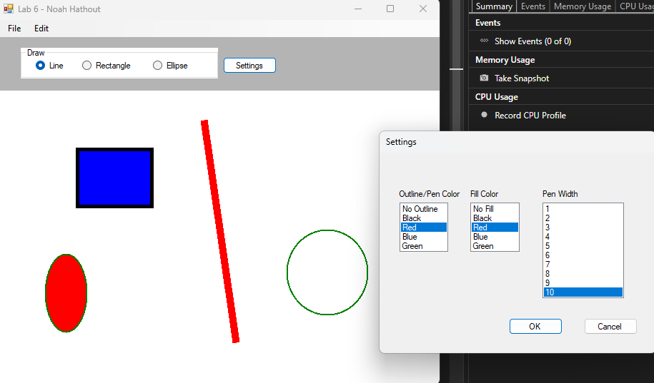

# WinForms-SketchPad

*A compact C# /.NET WinForms application for sketching lines, rectangles, and ellipses with custom outlines and fills.*

## Highlights
- **Shape choices** – draw Lines, Rectangles, or Ellipses via radio buttons  
- **Custom styling** – pick outline color, fill color, and pen width (1 – 10 px) in a dedicated **Settings** dialog  
- **Interactive canvas** – click two points to create a shape; a preview dot appears after the first click  
- **Editing tools**  
  - **Undo** – remove the most recent shape  
  - **Clear** – wipe the entire canvas  
- **Menu options** for Undo, Clear, and Exit  
- **Double-buffered panel** for smooth rendering

## Getting Started

### Prerequisites
- Visual Studio 2022 or later with the **.NET Desktop Development** workload  
- Target framework: .NET Framework 4.8 (feel free to retarget to any WinForms-capable version)
